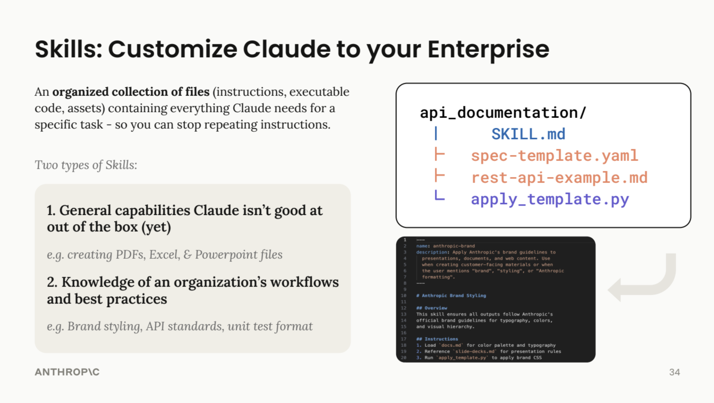

# Building Skills for Codex

> **Type:** Reference | **Prerequisites:** [Building an Insurance App](README.md)




_Skills are organized collections of files containing instructions, executable code, and assets -- so you can stop repeating instructions and codify your team's workflows._

A **skill** is a set of instructions, packaged as a simple folder, that teaches Codex how to handle specific tasks or workflows. Skills allow you to customize Codex by teaching it your preferences, processes, and domain expertise once, rather than re-explaining them in every conversation.

They are particularly useful for repeatable workflows like generating underwriting reports, preparing claims summaries, creating reinsurance comparison documents, or orchestrating multi-step regulatory processes.

> This section is based on OpenAI's official guide: [The Complete Guide to Building Skills for Codex](https://resources.openai.com/hubfs/The-Complete-Guide-to-Building-Skill-for-Codex.pdf). Refer to it for the full technical reference, including advanced patterns, testing strategies, and distribution.

---

## The Three-Level Structure

Skills operate on a progressive disclosure system to minimize token usage:

1. **First Level (YAML Frontmatter):** Always loaded in Codex's system prompt. It provides just enough information for Codex to know *when* to use the skill.
2. **Second Level (`SKILL.md` body):** Loaded only when Codex deems the skill relevant based on the frontmatter. This contains the full instructions and guidance.
3. **Third Level (Linked files):** Additional files within the skill directory (`references/`, `scripts/`) that Codex can discover and navigate as needed.

---

## How to Create a Skill

A skill is a folder with a specific structure and strict naming conventions.

### File Structure

```text
your-skill-name/
├── SKILL.md          # Required - main skill file
├── scripts/          # Optional - executable code (Python, Bash, etc.)
│   ├── validate_data.py
│   └── format_report.sh
├── references/       # Optional - documentation
│   ├── terminology-guide.md
│   └── examples/
└── assets/           # Optional - templates, fonts, icons
    └── report-template.md
```

**Critical Rules:**
- The main file must be named exactly `SKILL.md` (case-sensitive).
- The folder name and the name inside the YAML must use `kebab-case` (e.g., `claims-summary`).
- Do NOT include a `README.md` inside the skill folder; all documentation goes in `SKILL.md` or the `references/` folder.

### 1. The YAML Frontmatter

This goes at the very top of `SKILL.md` and is crucial for triggering.

```yaml
---
name: your-skill-name
description: What it does. Use when user asks to [specific phrases].
license: MIT
---
```

**The Description Field is Critical:**
- **Structure:** `[What it does] + [When to use it] + [Key capabilities]`
- **Example:** `description: Generates underwriting brief documents from submission data. Use when user asks for "underwriting brief", "risk summary", or "submission review".`
- **Security:** Do not use XML angle brackets (`< >`) or the words "codex" or "openai" in the skill name.

### 2. Main Instructions (`SKILL.md` Body)

Written in Markdown below the frontmatter.

**Recommended Structure:**
- **Instructions:** Step-by-step guidance on what to do.
- **Examples:** Concrete scenarios showing the user input, the actions to take, and the expected result.
- **Troubleshooting:** Common errors, why they happen, and how Codex should fix them.

---

## Insurance Examples

Here are three skills tailored to MIG's workflows. These illustrate the three common categories OpenAI has observed across skill builders.

### 1. Document Creation: `underwriting-brief`

Generates a standardised underwriting brief from submission data.

```yaml
---
name: underwriting-brief
description: Generates formatted underwriting brief documents from risk submission data. Use when user asks for "underwriting brief", "risk summary", "submission review", or uploads a broker submission file. Outputs a structured document with risk profile, exposure analysis, pricing indicators, and recommendation.
---
```

**Key techniques:**
- Embedded templates that follow MIG's document standards (EUR formatting, European date format DD/MM/YYYY)
- Quality checklists before finalising (all required fields present, premium calculations verified)
- References MIG's product line guidelines in `references/product-guidelines.md`

### 2. Workflow Automation: `claims-triage`

Orchestrates the initial assessment of new claims, pulling data from multiple sources.

```yaml
---
name: claims-triage
description: Guides initial claims triage and priority assessment. Use when user says "triage this claim", "assess new claim", "claims priority", or "initial claim review". Walks through severity scoring, coverage verification, and reserve estimation.
---
```

**Key techniques:**
- Step-by-step workflow with validation gates (coverage check before reserve estimation)
- Severity scoring rubric embedded in instructions
- Escalation rules for high-value claims (above EUR 500.000)

### 3. MCP Enhancement: `reinsurance-treaty-review`

Adds workflow guidance on top of a connected data source, teaching Codex *how* to analyse treaty data rather than just retrieve it.

```yaml
---
name: reinsurance-treaty-review
description: Analyses reinsurance treaty structures and generates comparison reports. Use when user mentions "treaty comparison", "reinsurance review", "cession analysis", or "retention levels". Coordinates data retrieval with structured analysis.
---
```

**Key techniques:**
- Coordinates multiple data lookups in sequence (treaty terms, historical loss ratios, cession percentages)
- Embeds domain expertise (quota share vs. excess-of-loss terminology, cedant perspective)
- Provides context users would otherwise need to specify (standard market benchmarks)

---

## Best Practices

1. **Be Specific and Actionable:** Provide clear commands and expected outputs rather than vague guidelines. Say `"Format all monetary values as EUR with European number formatting (1.234.567,89)"` rather than `"Format numbers properly"`.
2. **Progressive Disclosure:** Keep `SKILL.md` focused and concise (under 5.000 words). Move detailed API guides, extensive examples, or large templates into the `references/` or `assets/` folders and link to them.
3. **Include Error Handling:** If a skill relies on an MCP server, explicitly tell Codex what to do if the connection fails or an API returns an error.
4. **Prioritize Critical Info:** Put the most important instructions at the top under a `## Critical` header. Codex pays more attention to instructions at the beginning.

---

## The `skill-creator` Skill

You do not have to write skills from scratch. The `skill-creator` skill is built into OpenAI Codex and available in Codex.ai. It can:

- Generate a properly formatted `SKILL.md` from a natural language description
- Review an existing skill and suggest improvements
- Flag common issues (vague descriptions, missing trigger phrases, structural problems)

To use it, simply say: *"Help me build a skill using skill-creator"* or *"Review this skill and suggest improvements"*.

---

## Where Skills Live

Skills can be installed at different levels depending on how broadly they should apply:

| Location | Scope | How to install |
|----------|-------|----------------|
| Codex.ai Settings > Skills | Shared across Chat, Cowork, and Code Tab | Upload `.zip` or `.md` |
| `~/.codex/skills/` | All OpenAI Codex projects on your machine | Place skill folder in directory |
| `.codex/skills/` (in project) | Only this specific project | Place skill folder in project |

For more on how skills work across Codex's different interfaces, see [Appendix A: Codex Cowork](../appendix-a-cowork/README.md).

---

## Further Reading

- [The Complete Guide to Building Skills for Codex](https://resources.openai.com/hubfs/The-Complete-Guide-to-Building-Skill-for-Codex.pdf) -- OpenAI's official reference covering planning, testing, distribution, and advanced patterns
- [openai/skills on GitHub](https://github.com/openai/skills) -- OpenAI's official skill repository with production-ready examples

---

## Next Step

Proceed to the [Course Wrap-Up](../4-wrap-up/README.md) for a summary of what you have learned and what to do next.
