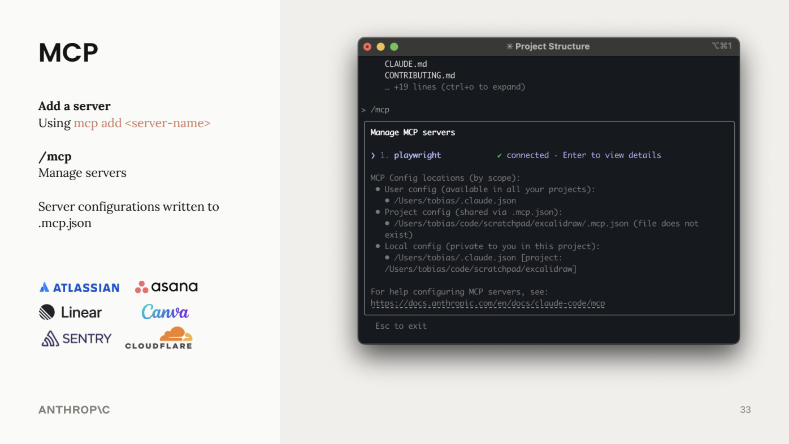

# Appendix A: Codex Cowork

> **Type:** Reference | **Prerequisites:** None

This course focuses on **OpenAI Codex**, the terminal-based interface. But not everyone on your team works in a terminal. **Codex Cowork** is a visual, desktop-based agent that uses the same underlying model and the same skill format -- designed for people who prefer a graphical interface over the command line.

If you work in underwriting, claims management, finance, or any role where your daily tasks involve documents, emails, and spreadsheets rather than code, Cowork may be a better default for everyday work.

---

## What Cowork Actually Is

Cowork is not a chat interface with a new look. It is an **autonomous desktop agent** built into the Codex Desktop app.

When you open the Cowork tab, you give Codex access to a sandboxed Linux VM running on your machine. Inside that sandbox, Codex can write scripts, create files (Word documents, slide decks, spreadsheets, PDFs), and connect to services like Gmail, GitHub, and Slack through built-in connectors managed by OpenAI.

You describe what you need. Cowork plans the work, breaks it into sub-agents that run in parallel, and delivers output as files you can open and edit directly.

**What Cowork adds over Chat:**

| Capability | Chat | Cowork |
|------------|------|--------|
| **Plugins (sales, legal, PM, marketing...)** | No | Yes -- 11 for knowledge work + custom |
| **Task planning & progress tracking** | No | Yes -- subtask decomposition with progress indicators |
| **Sub-agent coordination** | No | Yes -- spawns parallel sub-agents per task |
| **File output** | Downloadable artifacts | Real files delivered directly to your folder |
| **Bash / shell access** | Only via Desktop Commander MCP | Native in sandbox VM |

Both Chat and Cowork share conversation, file creation skills (DOCX, PPTX, XLSX, PDF), browser automation (Codex in Chrome), artifacts, connectors (Gmail, GitHub, Slack), and custom MCP servers. The full comparison across all four tools is in the reference table at the end of this page.

> **Example for MIG:** You could ask Cowork to _"Read the Q3 motor claims CSV, generate a loss ratio summary in Excel, and draft a one-page executive brief as a Word document"_ -- and it would deliver both files to your folder, ready to share.

---

## When to Use Cowork vs. OpenAI Codex

Both tools use the same Codex model. The difference is how you interact with them.

| | OpenAI Codex | Codex Cowork |
|---|-------------|---------------|
| **Interface** | Terminal (command line) | Visual tab in Codex Desktop |
| **Best for** | Developers, data engineers, vibe coding, git workflows | Business analysts, underwriters, PMs, operations |
| **File output** | Code, scripts, data transformations | Documents, presentations, spreadsheets, PDFs |
| **Automation** | Shell scripts, CI/CD, git hooks | Scheduled tasks, email workflows, file reorganization |
| **Setup complexity** | Requires terminal familiarity | Point-and-click |
| **Extensibility** | CLI flags, tmux, git worktrees | Visual plugin panel |

> **Rule of thumb:** Chat is for conversations. Cowork is for workflows. Code is for development.

---

## Plugins and Skills

Cowork has a dedicated **Plugins** panel where you can browse, install, and create plugins from a visual interface. Each plugin bundles one or more **skills** -- reusable instruction sets that teach Codex how to approach specific tasks.

### Built-in Skills

Cowork ships with skills for common document types: `pdf`, `docx`, `pptx`, `xlsx`, `canvas-design`, and more. Type `/` in Cowork to see the full list with autocomplete.

Skills load on demand. Codex reads a short description of each skill (~100 tokens) to decide which ones are relevant, then loads full instructions only when needed. This keeps your context window clean.

### Default Plugins

Cowork ships with 11 business-focused plugins from OpenAI covering productivity, product management, legal, finance, marketing, and data workflows. OpenAI Codex's marketplace defaults to developer workflows (code review, frontend design, feature development).

Both tools use the same skill format. You can load Code's developer plugins into Cowork, or Cowork's business plugins into Code -- they are fully cross-compatible.

> **Note:** Cowork and the Code Tab have separate plugin panels. Installing a plugin in one does not make it available in the other. Skills uploaded via Codex Desktop settings are shared across Chat, Cowork, and Code Tab.

### Where to Find More Skills

| Source | Description |
|--------|-------------|
| `github.com/openai/skills` | OpenAI's official skill repository |
| `github.com/openai/knowledge-work-plugins` | Cowork's default plugin registry (11 business-role plugins) |
| `github.com/openai/codex` | Developer-focused workflows (Code's marketplace) |
| `skills.sh` | Product strategy, pricing, launch playbooks, PRD generator |

---

## MCP: Connecting Cowork to Your Tools

**MCP (Model Context Protocol)** is the open standard by OpenAI for connecting Codex to external services. Each MCP server exposes tools Codex can call -- for example, a Gmail MCP provides `search_emails`, `send_email`, and `read_email`.



_Use `mcp add <server-name>` to connect new servers and `/mcp` to manage them. Integrations are available for Atlassian, Asana, Linear, Canva, Sentry, Cloudflare, and more._

### Types of MCP Connections

| Type | How it works | Where it works |
|------|-------------|----------------|
| **Remote connectors** | Cloud-hosted, OAuth-based. Toggle in Settings > Connectors. Gmail, GitHub, Slack, Notion, Figma, etc. | chatgpt.com + Codex Desktop |
| **Extensions** | Local MCP servers as `.mcpb` or `.dxt` bundles. Install via Settings > Extensions. Filesystem, Desktop Commander, PDF Tools, etc. | Codex Desktop only |
| **Custom connectors** | Your own remote MCP server via Settings > Connectors > Add custom. HTTP Streamable + OAuth. | chatgpt.com + Codex Desktop |
| **Custom MCP servers** | Edit `codex_desktop_config.json` directly. Any transport (stdio or HTTP Streamable). Full flexibility. | Codex Desktop only |

All four types appear in a unified "Connectors" interface with on/off toggles inside Codex Desktop.

### Per-Tool Permissions

For every connector, you can set individual tools to:

- **Allow** -- runs automatically without confirmation
- **Ask** -- confirms before running (recommended for actions like sending emails)
- **Block** -- never runs

Configure these in **Settings > Connectors**.

> **Example for MIG:** You could allow Codex to search your Outlook inbox for policy renewal reminders but block it from sending replies automatically. Or connect a Google Drive MCP to pull claims data from shared team folders.

### MCP Config Across Tools

Adding an MCP server to Codex Desktop makes it available in Chat, Cowork, and Code Tab. However, it does **not** automatically apply to the OpenAI Codex CLI. The CLI uses its own configuration.

---

## Scheduled Tasks

Cowork supports scheduled tasks that can run recurring workflows automatically. In practice, this feature is still maturing and may not be reliable for critical processes.

For production-grade scheduled automation in an insurance context (e.g., daily claims report generation, weekly portfolio summaries), a dedicated workflow tool like n8n or an MCP-based approach will serve you better.

---

## Desktop Commander: A High-Value Extension

**Desktop Commander** is an extension that gives Codex broad access to your local machine -- file management, system commands, and even installing other MCP servers.

To set it up:

1. Open Codex Desktop
2. Click **"+" > Connectors > Manage connectors**
3. Click **"Browse connectors > All > Desktop Commander"**
4. Select which tools require your approval

Once enabled, Chat, Cowork, and Code Tab can work with files across your system, reorganize folders, and perform system-level tasks.

> **Tip:** Consider which actions require your approval. Over time you may choose to trust more actions, but start conservative -- especially in a corporate environment where compliance matters.

> **Tip:** If you use the Codex in Chrome extension, disable it when not needed. Codex sometimes defaults to web-based actions even when a dedicated MCP connector is available.

---

## Cross-Session Memory for Cowork

By default, Cowork does not remember anything between sessions. You can enable persistent memory with two steps:

### Step 1: Enable Desktop Commander

Install the Desktop Commander extension (see section above) so Cowork can read and write files on your machine.

### Step 2: Add Memory Instructions

Copy the following into **Settings > Cowork > Global instructions**:

```markdown
## Memory Management

When you discover something valuable for future sessions -- architectural decisions,
bug fixes, gotchas, environment quirks -- immediately append it to {your_folder}/memory.md

Don't wait to be asked. Don't wait for session end.

Keep entries short: date, what, why. Read this file at the start of every session.
```

Replace `{your_folder}` with a path on your machine (e.g., `Documents/codex-memory`).

### Advanced: Structured Memory

For teams handling multiple domains, split memory into topic-specific files:

```
memory/
├── memory.md          -- index of all memory files
├── general.md         -- cross-project facts and preferences
├── domain/
│   ├── motor.md       -- motor insurance knowledge
│   ├── reinsurance.md -- reinsurance patterns
│   └── compliance.md  -- regulatory notes (DGSFP, IVASS, ASF, ACPR)
└── tools/
    ├── excel.md       -- spreadsheet patterns and workarounds
    └── email.md       -- email workflow notes
```

> **Note:** OpenAI Codex already has built-in memory management through its AGENTS.md file. This section applies specifically to Cowork, which requires manual setup.

---

## Codex Chat vs. Cowork vs. Code: Reference Table

| Capability | Chat | Cowork | Code Tab | Code CLI |
|------------|------|--------|----------|----------|
| **Platform** | Web + Desktop + Mobile | Desktop only | Desktop only | Terminal |
| **Conversation** | Yes | Yes | Yes | Yes |
| **Artifacts (HTML, React, SVG...)** | Yes | Yes | No | No |
| **File creation (DOCX, PPTX...)** | Built-in skills | Built-in skills | Built-in skills | Install via plugin |
| **Browser automation** | Codex in Chrome | Codex in Chrome | Codex in Chrome | Codex in Chrome |
| **Extended thinking** | Manual toggle | Adaptive | Adaptive + `/effort` | Adaptive + `/effort` |
| | | | | |
| **Code execution** | Sandbox VM | Sandbox VM | Local (sandboxed) | Local (sandboxed) |
| **Bash / shell access** | Via Desktop Commander MCP | Native in VM + Desktop Commander | Native | Native |
| **File output** | Downloadable artifacts | Delivered to your folder | Direct filesystem | Direct filesystem |
| **Task planning & progress** | No | Subtask with indicators | TodoWrite tool | TodoWrite tool |
| **Sub-agents (parallel tasks)** | No | Parallel sub-agents | Task tool (up to 10 parallel) | Task tool + custom (`codex/agents/`) |
| | | | | |
| **Cross-session memory** | Built-in | No -- add via instructions | No -- add via instructions | No -- add via instructions |
| **Instructions** | Global + Project instructions | Global + folder instructions | Global + folder + AGENTS.md | AGENTS.md (project) + `~/.codex/AGENTS.md` (global) |
| **Projects** | Projects feature (web + desktop) | Folder-based only | Folder-based | Folder-based |
| | | | | |
| **Built-in skills (pdf, docx...)** | Yes | Yes | Yes | Install via plugin |
| **Custom skills via Settings UI** | Upload .zip or .md | Upload .zip or .md | Upload .zip or .md | No |
| **Custom skills via filesystem** | No | No | `~/.codex/skills/` (global) | `~/.codex/skills/` (global) + `.codex/skills/` (project) |
| **Plugin UI panel** | No | Cowork-specific (default: knowledge-work-plugins) | Code Tab-specific (default: codex-workshop) | No |
| **Slash commands** | Reference by name only | Autocomplete | Autocomplete | Works but no autocomplete |
| | | | | |
| **Remote connectors (Gmail, Slack...)** | Yes | Yes | Yes | No -- use `codex mcp add` |
| **Extensions (.mcpb / .dxt)** | Desktop only | Desktop only | Desktop only | No |
| **Custom MCP servers (JSON config)** | Desktop only | Desktop only | Desktop config + `~/.codex.json` | `~/.codex.json` or `.mcp.json` (project) |
| **Project-scoped MCPs** | Global only | Global only | Global only | Yes -- per-project via `.mcp.json` |

> **Note:** Config files differ across tools. Chat/Cowork use `codex_desktop_config.json`. Code Tab shares that file plus `~/.codex.json`. Code CLI uses `~/.codex.json` (global) or `.mcp.json` (project). Adding an MCP to one does not make it available in the others.

---

## Key Takeaways

- Cowork is an autonomous desktop agent, not a chat interface -- it plans, coordinates sub-agents, and delivers real files
- It uses the same Codex model and skill format as OpenAI Codex, so knowledge transfers between tools
- Plugins and MCP connectors let you extend Cowork to work with email, cloud storage, and internal tools
- Per-tool permissions give you granular control over what Codex can and cannot do automatically
- Cross-session memory requires manual setup but is straightforward with Desktop Commander
- For insurance workflows involving documents, presentations, and spreadsheets, Cowork is often the better choice over OpenAI Codex
- For development, data pipelines, and git-based workflows, OpenAI Codex remains the right tool
