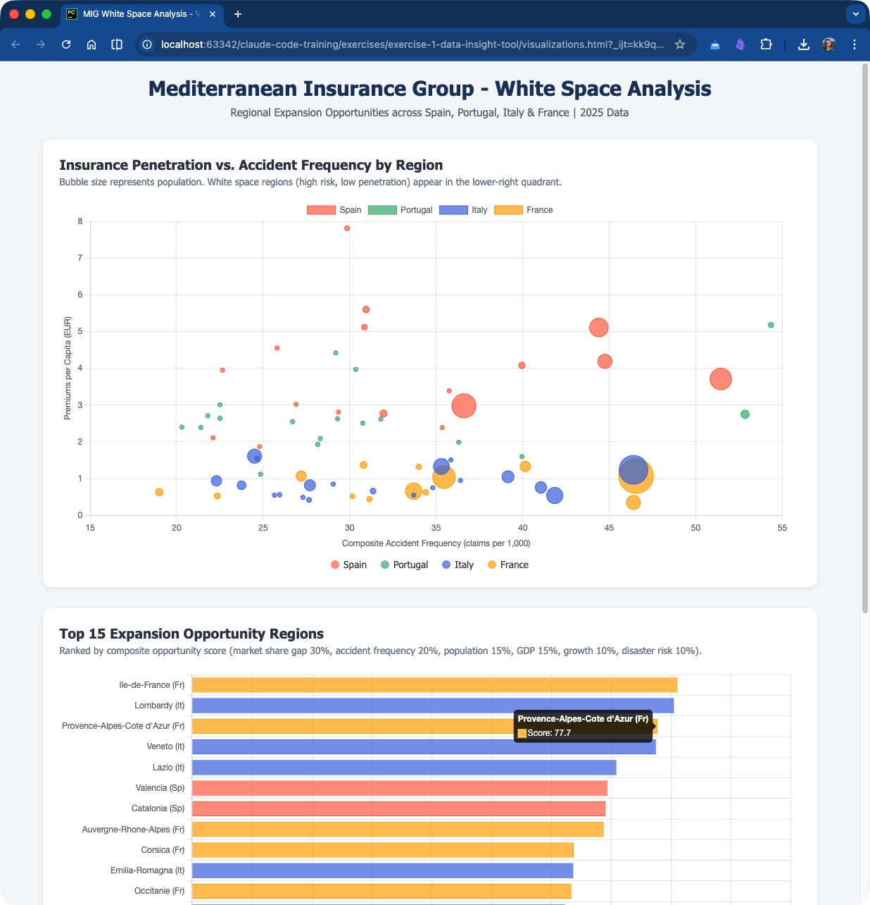

# Exercise 1: Data-Driven Insight Tool

## Objective

Build an end-to-end analytical workflow using OpenAI Codex that retrieves and combines insurance market and demographic data, structures it into a clean dataset, identifies **white spaces** (regions with high risk exposure but low insurance penetration), and produces executive-ready output -- all without writing any code yourself.

By the end of this exercise, you will have gone from four raw CSV files to a ranked list of expansion opportunities, interactive visualizations, and a professional memo for a senior stakeholder.

---

## Background: The Business Problem

**Mediterranean Insurance Group (MIG)** is a mid-size European insurer operating across Spain, Portugal, Italy, and Southern France. MIG has a strong foothold in rural Spain and Portugal but a minimal presence in the larger Italian and French markets.

**Isabel Santos**, MIG's Head of Strategy, has been tasked by the board with identifying the top priority regions for geographic expansion over the next 3 years. She has data scattered across multiple files maintained by different teams:

| File | Maintained By | Description |
|------|--------------|-------------|
| `market_penetration.csv` | Underwriting & Finance | MIG's premiums, policy counts, and market share by region and product line |
| `demographics.csv` | Market Intelligence | Population, income, urbanization, and growth data for each region |
| `accident_frequency.csv` | Claims & Actuarial | Claims frequency and natural disaster risk by region |
| `product_lines.csv` | Product Management | Product catalog with strategic priorities and financial targets |

Isabel needs someone to combine these sources, find the regions where demand is high but MIG's presence is low, and present the findings in a clear, actionable format. That someone is OpenAI Codex.

---

## Prerequisites

- OpenAI Codex installed and configured
- Terminal open in this exercise directory: `exercises/exercise-1-data-insight-tool/`
- Familiarity with CSV data (no coding experience required)

---

## Data Overview

Before starting, here is what each file contains:

| File | Rows | Key Columns |
|------|------|-------------|
| `market_penetration.csv` | 576 | `region_code`, `country`, `product_line`, `gross_written_premium_eur`, `policies_in_force`, `market_share_pct`, `year` (2024-2025) |
| `demographics.csv` | 68 | `region_code`, `country`, `population_2025`, `population_growth_rate_pct`, `median_household_income_eur`, `urbanization_rate_pct`, `gdp_per_capita_eur` |
| `accident_frequency.csv` | 68 | `region_code`, `country`, `motor_claims_per_1000_vehicles`, `home_claims_per_1000_policies`, `natural_disaster_risk_score` (1-10) |
| `product_lines.csv` | 20 | `product_line`, `sub_product`, `avg_premium_eur`, `loss_ratio_target_pct`, `growth_rate_pct`, `strategic_priority` |

The 68 regions span 4 countries: Spain (17 autonomous communities), Portugal (18 districts), Italy (20 regions), and France (13 metropolitan regions).

---

## Step-by-Step Instructions

### Step 1: Explore the Data (~5 minutes)

**Goal:** Understand what data is available, how the files relate to each other, and spot any quality issues before doing analysis.

**Prompt to type in OpenAI Codex:**

```text
Read all the CSV files in the data/ folder and give me a summary of what data we have, including column names, row counts, and any data quality issues you notice.
```

**What to expect:**
- OpenAI Codex will read each of the four CSV files
- It will produce a structured summary listing columns, row counts, data types, and value ranges
- It may flag observations like: uneven product coverage across regions, year-over-year data available only for market penetration, or regions with very small policy counts

**What to look for in the output:**
- Does Codex identify that `region_code` is the join key across files?
- Does it note that `market_penetration.csv` has multiple rows per region (by product line and year)?
- Does it highlight the difference in granularity between files?

> **Tip:** If the summary is too brief, follow up with: *"Give me more detail on the value distributions -- what are the min, max, and mean for the numeric columns in each file?"*

<details>
<summary>Example output from this step</summary>

```
## Data Summary

### 1. market_penetration.csv
- Rows: 576
- Columns: region_code, region_name, country, product_line,
  gross_written_premium_eur, policies_in_force, market_share_pct, year
- Years covered: 2024, 2025
- Countries: Spain (17 regions), Portugal (18 districts),
  Italy (20 regions), France (13 regions)
- Product lines: Motor, Home, Health, Commercial, Life
- Note: Multiple rows per region (by product line and year)
- Join key: region_code

### 2. demographics.csv
- Rows: 68 (one per region)
- Columns: region_code, region_name, country, population_2025,
  population_growth_rate_pct, median_age, median_household_income_eur,
  urbanization_rate_pct, gdp_per_capita_eur
- Population range: 172.574 (Coimbra) to 12.302.298 (Ile-de-France)
- GDP per capita range: EUR 15.388 (Viseu) to EUR 59.912 (Ile-de-France)

### 3. accident_frequency.csv
- Rows: 68 (one per region)
- Columns: region_code, region_name, country,
  motor_claims_per_1000_vehicles, home_claims_per_1000_policies,
  health_claims_per_1000_members, commercial_fire_incidents_per_1000_properties,
  natural_disaster_risk_score
- Motor claims range: 28,3 - 80,5 per 1.000 vehicles
- Natural disaster risk: 2 to 8 (scale 1-10)

### 4. product_lines.csv
- Rows: 20 (5 product lines x 4 sub-products each)
- Columns: product_line, sub_product, avg_premium_eur,
  avg_claim_cost_eur, loss_ratio_target_pct, growth_rate_pct,
  strategic_priority
- Product lines: Motor, Home, Health, Commercial, Life

### Data Quality Observations
- region_code is the common join key across the first 3 files
- market_penetration has different granularity (product line + year)
  vs. demographics and accident_frequency (region level only)
- Not all regions have all 5 product lines in market_penetration
  (some regions only have 3-4 lines in a given year)
- product_lines.csv does not join to the other files on region_code;
  it provides reference data on product characteristics
```

</details>

---

### Step 2: Combine and Structure the Data (~10 minutes)

**Goal:** Merge the separate data sources into a single analytical dataset with calculated metrics.

**Prompt to type in OpenAI Codex:**

```text
- Combine the market penetration, demographics, and accident frequency data into a single unified dataset. 
- Join on region_code. 
- Calculate insurance penetration rate (premiums per capita) and risk-adjusted penetration (penetration / accident frequency). 
- Save as a clean CSV called combined_analysis.csv
```

**What to expect:**
- OpenAI Codex will write a Python script that:
  - Reads all three CSV files
  - Aggregates `market_penetration.csv` to region level (summing across product lines, using 2025 data)
  - Joins on `region_code`
  - Calculates derived metrics:
    - `premiums_per_capita` = total GWP / population
    - `risk_adjusted_penetration` = premiums_per_capita / composite_accident_frequency
  - Saves the result as `combined_analysis.csv`

**What to look for:**
- Does the join produce 68 rows (one per region)?
- Are the calculated columns sensible? (Spain/Portugal should show higher penetration; Italy/France lower)
- Does Codex handle the aggregation from product-line level to region level correctly?

> **Tip:** If you want to keep product-line detail, try: *"Actually, keep the product_line breakdown in the combined dataset too -- I want to see penetration by region AND product line."*

<details>
<summary>Example output from this step</summary>

```
Combined dataset written to: combined_analysis.csv
Total regions: 68

Country breakdown:
Country       Regions      Total GWP (EUR)   Total Policies
------------------------------------------------------------
France             13       47.708.057,00           89.793
Italy              20       59.089.647,00          127.926
Portugal           18       35.206.703,00          117.407
Spain              17      183.815.883,00          476.754

First 10 rows preview:
Region                         Country    GWP (EUR)       Pop.   Prem/Cap  Avg MktShr%  Risk-Adj
-------------------------------------------------------------------------------------------------
Andalusia                      Spain    25.506.227   8.567.621       2,98         6,43    0,0814
Aragon                         Spain     1.729.298     614.647       2,81         7,82    0,0957
Asturias                       Spain     3.272.709   1.083.985       3,02         9,05    0,1123
Cantabria                      Spain     6.931.513   2.499.103       2,77         6,10    0,0867
Castile and Leon               Spain    13.790.999   1.766.807       7,81        10,54    0,2616
Castile-La Mancha              Spain     1.091.710     584.671       1,87         7,23    0,0754
Canary Islands                 Spain     3.089.294     678.700       4,55        10,06    0,1764
Catalonia                      Spain    28.498.407   7.685.277       3,71         3,49    0,0721
Extremadura                    Spain     2.043.071     967.807       2,11         5,78    0,0955
Galicia                        Spain     3.975.731   1.171.132       3,39        10,60    0,0948

Key statistics:
  GWP range: EUR 352.779 - EUR 33.934.670
  Premiums per capita range: EUR 0,35 - EUR 7,81
  Risk-adjusted penetration range: 0,0075 - 0,2616
  Avg market share range: 0,03% - 10,60%
```

The combined dataset has 17 columns per row, including the original fields
from all three source files plus the two calculated metrics:
- `premiums_per_capita` = total GWP / population
- `risk_adjusted_penetration` = premiums per capita / composite accident frequency

Spain dominates in absolute GWP (EUR 183,8M) and market share (avg ~6,7%),
while Italy and France show much lower penetration (avg below 0,5%).

</details>

---

### Step 3: Identify White Spaces (~10 minutes)

**Goal:** Find regions where demand indicators are strong but MIG's presence is weak -- the best expansion opportunities.

**Prompt to type in OpenAI Codex:**

```text
Analyze the combined dataset to find white spaces - regions where there is high risk exposure (high accident frequency, growing population) but low insurance penetration. Rank regions by opportunity score. Create a summary table.
```

**What to expect:**
- OpenAI Codex will define an opportunity scoring methodology, likely combining:
  - Low MIG market share (room to grow)
  - High accident frequency (demand driver)
  - Population growth (expanding market)
  - High GDP per capita or income (ability to pay)
  - High urbanization (distribution efficiency)
- It will rank all 68 regions and present a table of the top opportunities
- Italian and French urban regions should rank highly (large markets where MIG barely exists)

**What to look for:**
- Does the scoring methodology make business sense?
- Are the top regions plausible? (Expect large Italian regions like Lombardy, Lazio, Campania and French regions like Ile-de-France, Provence-Alpes-Cote d'Azur)
- Does Codex explain its methodology, or does it just present numbers?

> **Tip:** Push Codex to refine the analysis: *"Weight the opportunity score more heavily toward regions where MIG already has some presence (market share > 0,1%) -- pure greenfield markets may be too risky."*

<details>
<summary>Example output from this step</summary>

```
Opportunity Scoring Methodology
================================
Each region is scored on 6 factors, normalized to 0-100 and weighted:

  Factor                      Weight  Logic
  ------------------------- --------  ----------------------------------------
  Market share gap               30%  Lower MIG market share = higher score
  Accident frequency             20%  Higher claims frequency = more demand
  Population size                15%  Larger population = bigger market
  GDP per capita                 15%  Higher income = ability to pay premiums
  Population growth              10%  Growing population = expanding market
  Natural disaster risk          10%  Higher risk = greater insurance need

  Opportunity Score = weighted sum of normalized factor scores (max 100)


TOP 15 EXPANSION OPPORTUNITY REGIONS
======================================
Rank  Region                         Country    Score  MktShr%  GWP (EUR)       Population  AccFreq
-----------------------------------------------------------------------------------------------------
1     Ile-de-France                  France      81,0     0,12  13.169.767     12.302.298     46,6
2     Lombardy                       Italy       80,4     0,19  12.600.787     10.182.995     46,4
3     Provence-Alpes-Cote d'Azur     France      77,7     0,03   1.756.743      5.010.151     46,4
4     Veneto                         Italy       77,4     0,14   3.063.116      4.054.553     41,1
5     Lazio                          Italy       70,8     0,09   3.106.378      5.764.037     41,9
6     Valencia                       Spain       69,3     2,85  21.130.911      5.045.024     44,8
7     Catalonia                      Spain       69,0     3,49  28.498.407      7.685.277     51,5
8     Auvergne-Rhone-Alpes           France      68,7     0,06   8.369.544      8.030.236     35,5
9     Corsica                        France      63,7     0,26   4.919.593      3.702.201     40,2
10    Emilia-Romagna                 Italy       63,6     0,27   4.475.356      4.246.797     39,2
11    Occitanie                      France      63,3     0,12   3.864.480      5.859.662     33,7
12    Lisbon                         Portugal    62,2     2,68   8.077.698      2.934.782     52,9
13    Porto                          Portugal    62,1     2,59   9.696.022      1.872.748     54,4
14    Campania                       Italy       61,6     0,47   7.516.296      5.635.203     35,3
15    Normandy                       France      58,1     0,11     843.522      1.911.737     31,2
```

Score component breakdown for Top 5:

```
Region                          MktGap  AccFrq   PopSz     GDP   PopGr  DisRsk   TOTAL
---------------------------------------------------------------------------------------
Ile-de-France                     99,1    77,9   100,0   100,0    56,3     0,0    81,0
Lombardy                          98,5    77,5    82,5    64,0   100,0    33,3    80,4
Provence-Alpes-Cote d'Azur       100,0    77,5    39,9    79,9    92,2    50,0    77,7
Veneto                            99,0    62,4    32,0    83,2    95,8    83,3    77,4
Lazio                             99,4    64,6    46,1    74,9    65,9    33,3    70,8
```

Italian and French urban regions dominate the top positions -- large markets
where MIG has minimal presence. Spain's Valencia and Catalonia also appear
due to their large populations and relatively low MIG share vs. other
Spanish regions.

</details>

---

### Step 4: Generate Visualizations (~10 minutes)

**Goal:** Create interactive charts that make the findings easy to present to stakeholders.

**Prompt to type in OpenAI Codex:**

```text
Create an HTML page with interactive charts showing: 1) A scatter plot of penetration rate vs accident frequency by region (bubble size = population), 2) A bar chart of top 15 opportunity regions by score, 3) A heatmap of penetration by country and product line. Use Chart.js or similar.
```

**What to expect:**
- OpenAI Codex will generate a self-contained HTML file (e.g., `visualizations.html`) that includes:
  - **Chart 1 - Scatter Plot:** X-axis = accident frequency, Y-axis = penetration rate, bubble size = population, color-coded by country. White space regions appear in the lower-right quadrant (high risk, low penetration).
  - **Chart 2 - Bar Chart:** Top 15 regions ranked by opportunity score.
  - **Chart 3 - Heatmap:** A grid of countries vs. product lines showing penetration intensity.
- The file should open directly in a browser with no server required

**What to look for:**
- Do the charts render correctly when you open the HTML file?
- Is the scatter plot labeled clearly? Can you identify the white space quadrant?
- Does the heatmap clearly show where MIG is strong (Spain/Portugal Motor) vs. weak (Italy/France across the board)?

> **Tip:** If a chart does not look right, describe the issue to Codex: *"The scatter plot axes are too compressed -- the Italian regions are all clustered together. Can you use a log scale on the Y-axis and add region labels on hover?"*

<details>
<summary>Example output from this step</summary>

OpenAI Codex generates a self-contained `visualizations.html` file (~14 KB) using
Chart.js loaded from CDN. The file contains three interactive charts:

**Chart 1 -- Bubble/Scatter Plot: Penetration vs. Accident Frequency**
- X-axis: Composite accident frequency (motor + home claims avg per 1.000)
- Y-axis: Premiums per capita (EUR)
- Bubble size proportional to regional population
- Color-coded: Spain (red), Portugal (green), Italy (blue), France (orange)
- Spanish regions cluster in the upper portion (higher penetration, EUR 2-8 per capita)
- Italian and French regions cluster in the lower-left and lower-right
  (low penetration, EUR 0,35-1,60 per capita)
- The "white space quadrant" (lower-right: high accident frequency, low penetration)
  contains Lombardy, Ile-de-France, Lazio, and Provence-Alpes-Cote d'Azur
- Hovering over any bubble shows region name and exact values

**Chart 2 -- Horizontal Bar Chart: Top 15 Opportunity Regions**
- Bars ranked from highest to lowest opportunity score (0-100 scale)
- Ile-de-France leads at 81,0, followed by Lombardy at 80,4
- Color-coded by country to show geographic distribution of opportunities
- 6 French regions, 5 Italian regions, 2 Spanish, 2 Portuguese in the top 15

**Chart 3 -- Heatmap: Penetration by Country & Product Line**
- 4x5 grid (countries x product lines) showing GWP per capita
- Darker red cells = higher MIG penetration (Spain Motor is the darkest)
- Near-white cells = minimal MIG presence (Italy and France across most lines)
- Spain shows significantly darker shading across all product lines
- Italy and France are consistently light, confirming the expansion opportunity

Open `visualizations.html` directly in any modern browser (Chrome, Firefox, Safari)
to view the interactive charts. No server or internet connection required beyond
the initial Chart.js CDN load.

</details>

### Example Final Result (Browser View)



_Example output of the generated interactive visualization page opened in a browser._

---

### Step 5: Executive Summary (~5 minutes)

**Goal:** Produce a polished, executive-ready memo summarizing the analysis and recommendations.

**Prompt to type in OpenAI Codex:**

```text
Write an executive summary for Isabel Santos (Head of Strategy at MIG) highlighting the top 5 priority regions for expansion, why they were selected, and recommended next steps. Format as a professional memo.
```

**What to expect:**
- OpenAI Codex will generate a professional memo (likely as a `.md` or `.txt` file) containing:
  - **Header:** To/From/Date/Subject
  - **Executive Summary:** 2-3 sentence overview
  - **Methodology:** Brief description of the scoring approach
  - **Top 5 Priority Regions:** Each with data points and rationale
  - **Recommended Next Steps:** Concrete actions (e.g., "Commission detailed feasibility study for Lombardy Motor market")
  - **Appendix reference:** Pointer to the full dataset and visualizations

**What to look for:**
- Is the tone appropriate for a C-suite audience?
- Are the recommendations backed by specific data points from the analysis?
- Does it acknowledge risks or limitations?

> **Tip:** If the memo is too generic, sharpen it: *"Add specific premium opportunity estimates for each region -- what is the addressable market size in EUR if MIG reached 2% market share?"*

<details>
<summary>Example output from this step</summary>

OpenAI Codex generates `executive_summary.md` -- a professional memo with
the following structure (excerpt shown):

```markdown
# MEMORANDUM

**To:** Isabel Santos, Head of Strategy
**From:** Market Intelligence & Analytics Team
**Date:** 26/02/2026
**Subject:** Regional Expansion Opportunity Assessment -- Top Priority Markets

---

## Executive Summary

This analysis identifies the highest-priority regions for MIG's geographic
expansion based on a systematic evaluation of 68 regions across Spain,
Portugal, Italy, and France. [...] The top opportunities are concentrated
in large Italian and French urban regions where MIG's market share is below
0,3% despite strong demand indicators.

---

## Top 5 Priority Regions

### 1. Ile-de-France (France) -- Score: 81,0

| Metric | Value |
|--------|-------|
| Population | 12.302.298 |
| Current MIG market share | 0,12% |
| MIG GWP (2025) | EUR 13.169.767 |
| GDP per capita | EUR 59.912 |
| Estimated addressable market at 2% share | EUR 219.496.117 |

### 2. Lombardy (Italy) -- Score: 80,4
[...]

## Recommended Next Steps

1. Commission detailed feasibility studies for Ile-de-France (Motor)
   and Lombardy (Motor + Health) as Phase 1 markets (Q2 2026).
2. Explore partnership or acquisition targets in Italy and France.
3. Develop a Provence-Alpes-Cote d'Azur pilot programme.
4. Create product adaptations for IVASS and ACPR requirements.
5. Present this analysis to the Board with a three-year expansion roadmap.

## Caveats and Limitations
- Opportunity scoring weights are based on strategic judgment
- Regulatory barriers and competitive intensity not captured
- Does not account for Solvency II capital requirements
```

The full memo is approximately 140 lines and includes detailed data tables
for each of the top 5 regions, key takeaways, and risk disclaimers.

</details>

---

## What You Will Learn

By completing this exercise, you will have practiced:

| Skill | How It Was Used |
|-------|----------------|
| **Multi-file data exploration** | Step 1: Reading and summarizing four CSV files in one prompt |
| **Data joining and transformation** | Step 2: Merging datasets on a common key, aggregating, and computing new metrics |
| **Analytical reasoning** | Step 3: Defining and applying a scoring methodology to identify business opportunities |
| **Visualization generation** | Step 4: Creating interactive HTML charts from structured data |
| **Executive communication** | Step 5: Translating data findings into a professional business memo |
| **Iterative refinement** | Throughout: Following up with clarifying prompts to improve outputs |

---

## Troubleshooting Tips

### "OpenAI Codex is not reading the files"
- Make sure your terminal is in the `exercise-1-data-insight-tool/` directory, or use absolute paths in your prompts
- Try being explicit: *"Read the file at data/market_penetration.csv"*

### "The join produced fewer rows than expected"
- Check if Codex is filtering to a single year. The `market_penetration.csv` file has data for both 2024 and 2025. Ask Codex: *"How many rows does the merged dataset have? I expected 68 regions."*

### "The opportunity score does not make sense"
- Ask Codex to explain its methodology: *"Walk me through how you calculated the opportunity score. What weight did you give each factor?"*
- Then adjust: *"Increase the weight of population growth and decrease the weight of GDP per capita."*

### "The HTML charts are not rendering"
- Open the file directly in Chrome, Firefox, or Safari (not by double-clicking -- use File > Open or drag into the browser)
- Check if Codex used a CDN link for Chart.js. If you are offline, ask: *"Inline the Chart.js library directly in the HTML file instead of using a CDN."*

### "The output is too long / too short"
- OpenAI Codex responds to length guidance. Try: *"Keep the executive summary to one page maximum"* or *"Give me a more detailed breakdown with numbers for every region."*

### "I want to restart from a specific step"
- You can jump to any step. The data files are static, so you can always re-run from Step 1. If you want to restart from Step 3, just make sure `combined_analysis.csv` exists from Step 2.

---

## Bonus Challenges

If you finish early or want to go deeper:

1. **Sensitivity Analysis:** *"Run the opportunity scoring with three different weighting schemes and show me how the top 10 changes."*

2. **Time Series:** *"Compare 2024 vs 2025 market penetration data. Which regions are growing fastest for MIG? Are there any regions where MIG is losing share?"*

3. **Product-Level Drill-Down:** *"For the top 5 opportunity regions, which specific product lines have the biggest gap? Create a product-region matrix."*

4. **Risk Overlay:** *"Cross-reference the opportunity regions with the natural disaster risk score. Flag any high-opportunity regions that also have high climate risk (score >= 7)."*

5. **Competitor Inference:** *"If MIG's market share in Lombardy is 0,3%, and the total market is implied by our GWP / market_share, what is the total addressable market in each of the top 10 opportunity regions?"*

---

## Expected Time

| Step | Duration |
|------|----------|
| Step 1: Explore the data | ~5 min |
| Step 2: Combine and structure | ~10 min |
| Step 3: Identify white spaces | ~10 min |
| Step 4: Generate visualizations | ~10 min |
| Step 5: Executive summary | ~5 min |
| **Total** | **~40 minutes** |

---

## Files Produced

By the end of this exercise, your directory should contain:

```text
exercise-1-data-insight-tool/
  README.md                  <-- This file
  data/
    market_penetration.csv   <-- Source data (576 rows)
    demographics.csv         <-- Source data (68 rows)
    accident_frequency.csv   <-- Source data (68 rows)
    product_lines.csv        <-- Source data (20 rows)
  combined_analysis.csv      <-- Generated in Step 2
  visualizations.html        <-- Generated in Step 4
  executive_summary.md       <-- Generated in Step 5
```
