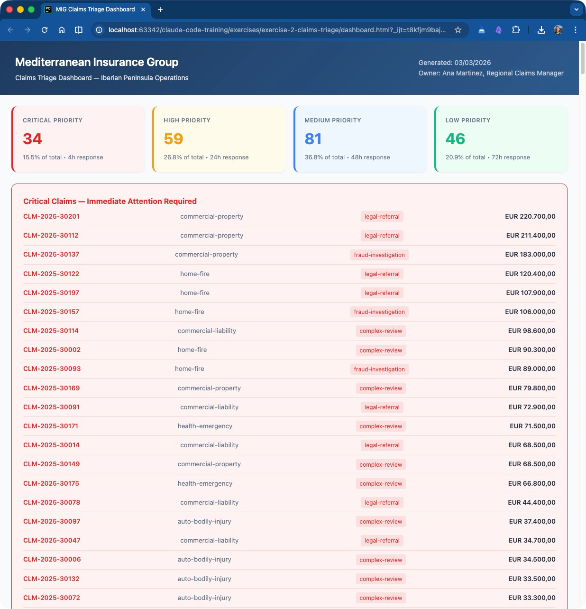

# Exercise 2: Claims Triage Prototype

**Duration:** ~45 minutes
**Difficulty:** Intermediate
**Company:** Mediterranean Insurance Group (MIG)

---

## Objective

Create a lightweight prototype that supports a recurring insurance process: **claims triage**. You will define business rules for classification, prioritization, and routing, then apply those rules to a batch of incoming claims. The goal is to produce consistent output showing each claim's category, priority level, and suggested handling path.

By the end of this exercise, you will have a working triage system that processes 220 incoming claims and presents the results in a professional HTML dashboard.

---

## Background

**Ana Martinez** is the Regional Claims Manager at MIG's Barcelona office. She manages a team of 20 adjusters who handle claims across the Iberian Peninsula (Spain and Portugal).

Currently, claims triage is entirely manual. Each new claim is read individually by a senior adjuster, who assigns a category, priority, and handling path based on experience. This process is slow, inconsistent, and does not scale well during peak periods (storm season, holiday weekends).

Ana wants a prototype that can **automatically classify, prioritize, and route incoming claims** based on defined business rules. She has provided:

- **220 new incoming claims** waiting to be triaged (`incoming_claims.csv`)
- **Business rules** that her team currently follows informally (`business_rules.json`)
- **160 historical claims** with known outcomes to help calibrate the rules (`historical_outcomes.csv`)

Your job is to use OpenAI Codex to build this prototype step by step.

---

## Data Files

All data files are in the `data/` folder:

| File | Description | Records |
|------|-------------|---------|
| `incoming_claims.csv` | New claims awaiting triage | 220 claims |
| `business_rules.json` | Triage rules for classification, priority, routing, and fraud detection | -- |
| `historical_outcomes.csv` | Past claims with known outcomes and adjuster notes | 160 claims |

---

## Step-by-Step Instructions

### Step 1: Understand the Data (~5 minutes)

Start by asking OpenAI Codex to explore and summarize all the data files. This gives you a foundation before building anything.

**Open your terminal in the exercise folder, then type:**

```bash
codex
```

Once OpenAI Codex is running, enter this prompt:

```text
Read all files in the data/ folder. Summarize the incoming claims data, the business
rules, and the historical outcomes. How many claims do we have? What categories exist?
What are the key business rules? Are there any data quality issues?
```

**What to expect:**
- A summary showing 220 incoming claims and 160 historical outcomes
- A breakdown of product lines (Motor, Home, Health, Commercial) and incident types
- An overview of the business rules structure: priority levels, category mappings, handling paths, team assignments, SLA targets, and fraud indicators
- Possibly some observations about data patterns (repeat claimants, missing fields, etc.)

**Why this matters:**
Before writing any code, you need to understand the data and rules. OpenAI Codex reads and synthesizes multiple files at once, which would take you much longer to do manually.

<details>
<summary>Example output from this step</summary>

```
=== INCOMING CLAIMS SUMMARY ===
Total claims: 220

Product Lines:
  Motor: 79       Home: 79       Health: 36       Commercial: 26

Incident Types (top 5):
  theft: 36       water_damage: 33       collision: 32
  glass_damage: 14       fire: 13

Regions (top 5):
  Madrid: 56       Catalunya: 50       Valencia: 30
  Andalucia: 27       Galicia: 17

Estimated Amount (EUR):
  Min: 154,95       Max: 220.700,00       Mean: 20.172,45
  Total exposure: 4.437.939,33

Injury Reported: Yes=19, No=201
Police Report Filed: Yes=83, No=137
Status: New=196, Under Review=24

=== DATA QUALITY OBSERVATIONS ===
- Claims with >30 days reporting delay: 14
- Repeat claimants (2+ claims): 60
  Elena Rossi Delgado: 6 claims
  Francesca Romero Reyes: 6 claims
  Chiara Delgado Morales: 4 claims
- Claims with suspiciously round amounts (>= EUR 5.000): 21
- 41 claims already have an adjuster assigned

=== HISTORICAL OUTCOMES (160 claims) ===
Outcomes: Approved=75, Partially Approved=39, Denied=24,
          Fraud Confirmed=12, Withdrawn=10
Fraud rate: 7,5%
Average resolution: 20,3 days
```

</details>

---

### Step 2: Define the Triage Rules (~10 minutes)

Now ask OpenAI Codex to formalize the triage logic by combining the business rules with insights from historical outcomes.

**Enter this prompt:**

```text
Based on the business_rules.json and historical outcomes, create a comprehensive triage
system. For each incoming claim, determine:

1) Claim category (auto-bodily-injury, auto-property, home-water-damage, home-fire,
   home-theft, health-emergency, health-routine, commercial-liability, commercial-property)
2) Priority level (Critical/High/Medium/Low) based on estimated amount, injury
   involvement, and time sensitivity
3) Handling path (fast-track, standard, complex-review, fraud-investigation, legal-referral)

Document the rules clearly in a file so we can review and adjust them.
```

**What to expect:**
- A structured document (likely Markdown or a code file) that clearly maps out every triage decision
- Rules that combine multiple data points: product line + incident type for category, amount thresholds + injury flags for priority, and category + priority + fraud signals for handling path
- Alignment with the historical data -- e.g., if historical "fast-track" claims were mostly under 2.000 EUR, the rules should reflect that

**Why this matters:**
This step forces clarity. Informal rules in a JSON file become explicit, reviewable logic. You can iterate on these rules later.

<details>
<summary>Example output from this step</summary>

OpenAI Codex will create a file like `triage_rules.md` with structured rules. Here is the key structure:

**Category Assignment** -- maps product_line + incident_type to 9 categories:

| Product Line | Incident Type | Category |
|---|---|---|
| Motor | collision (with injury) | auto-bodily-injury |
| Motor | collision (no injury) | auto-property |
| Motor | theft, vandalism, glass_damage | auto-property |
| Home | water_damage, storm_damage | home-water-damage |
| Home | fire, electrical_damage | home-fire |
| Home | theft, vandalism | home-theft |
| Health | medical_emergency, hospitalization, surgery | health-emergency |
| Health | outpatient, dental, physiotherapy | health-routine |
| Commercial | slip_and_fall, product_liability | commercial-liability |
| Commercial | property_damage, fire, flood | commercial-property |

**Priority Levels** (first match wins, evaluated top-to-bottom):

```
Critical: amount > EUR 50.000, or injury + amount > EUR 10.000,
          or commercial fire, or hospitalization
High:     amount > EUR 20.000, or injury, or any fire,
          or theft > EUR 10.000, or liability claims
Medium:   amount EUR 5.000-20.000, or water/storm damage,
          or police report filed
Low:      amount < EUR 5.000, or glass/dental/physiotherapy/outpatient
```

**Handling Paths:**

```
fast-track:          Low priority + < EUR 2.000, glass damage,
                     routine health < EUR 3.000
standard:            Low/Medium not fast-track eligible
complex-review:      High/Critical priority, > EUR 20.000, fire claims
fraud-investigation: 2+ fraud indicators triggered
legal-referral:      Liability + injury, amount > EUR 100.000,
                     professional negligence
```

**Fraud Indicators** (2+ triggers mandate SIU referral):
- FI-001: Multiple recent claims (2+ in 90 days) -- High severity
- FI-004: Delayed reporting >30 days -- Medium severity
- FI-005: No police report for theft/vandalism -- High severity
- FI-008: Suspiciously round estimates >= EUR 5.000 -- Low severity

</details>

---

### Step 3: Apply Triage to Incoming Claims (~10 minutes)

Apply the triage rules to every one of the 220 incoming claims.

**Enter this prompt:**

```text
Apply the triage rules to all claims in incoming_claims.csv. For each claim, add columns
for: assigned_category, priority_level, handling_path, assigned_team, estimated_resolution_days,
and a brief justification. Save the results as triaged_claims.csv
```

**What to expect:**
- A new CSV file (`triaged_claims.csv`) with all original columns plus 6 new ones
- Every claim categorized, prioritized, and routed
- Justifications like "Critical priority: estimated amount 90.300 EUR exceeds 50.000 threshold" or "Fraud investigation: theft claim filed without police report"
- Some claims flagged for fraud investigation (repeat claimants, delayed reporting, missing police reports for theft)

**Why this matters:**
This is where the rules get tested against real data. You will see how well the rules handle the variety of claims, and whether any edge cases fall through the cracks.

<details>
<summary>Example output from this step</summary>

**Summary statistics from the triage run:**

```
Total claims processed: 220

PRIORITY DISTRIBUTION:
  Critical  :   34 (15,5%)
  High      :   59 (26,8%)
  Medium    :   81 (36,8%)
  Low       :   46 (20,9%)

CATEGORY DISTRIBUTION:
  auto-property            :   70 (31,8%)
  home-water-damage        :   41 (18,6%)
  health-routine           :   23 (10,5%)
  home-theft               :   21 ( 9,5%)
  home-fire                :   17 ( 7,7%)
  commercial-property      :   15 ( 6,8%)
  health-emergency         :   13 ( 5,9%)
  commercial-liability     :   11 ( 5,0%)
  auto-bodily-injury       :    9 ( 4,1%)

HANDLING PATH DISTRIBUTION:
  standard                 :   77 (35,0%)
  complex-review           :   67 (30,5%)
  fast-track               :   41 (18,6%)
  fraud-investigation      :   23 (10,5%)
  legal-referral           :   12 ( 5,5%)

TEAM WORKLOAD:
  Motor Claims Unit (BCN-MOT)            :   71
  Property Claims Unit (BCN-PROP)        :   69
  Health Claims Unit (BCN-HLT)           :   34
  Special Investigations Unit (BCN-SIU)  :   23
  Legal & Compliance (BCN-LEG)           :   12
  Commercial Lines Unit (BCN-COM)        :   11
```

**Sample triaged rows:**

| Claim ID | Category | Priority | Handling Path | Team | Justification |
|---|---|---|---|---|---|
| CLM-2025-30002 | home-fire | Critical | complex-review | BCN-PROP | Amount EUR 90.300 exceeds 50.000 |
| CLM-2025-30004 | auto-bodily-injury | Critical | complex-review | BCN-MOT | Injury + amount EUR 10.700 (>10.000) |
| CLM-2025-30014 | commercial-liability | Critical | legal-referral | BCN-LEG | Amount EUR 68.500 + injury |
| CLM-2025-30026 | auto-property | Low | fast-track | BCN-MOT | Amount EUR 978 below 5.000 |
| CLM-2025-30093 | home-fire | Critical | fraud-investigation | BCN-SIU | 2 fraud flags: repeat claimant + 48-day delay |

</details>

---

### Step 4: Build a Dashboard (~15 minutes)

Create a visual summary of the triage results that Ana could share with her team.

**Enter this prompt:**

```text
Create an HTML dashboard that shows:

1) Summary statistics (claims by priority, by category, by handling path)
2) A table of all triaged claims sortable by priority
3) Alerts for any Critical priority claims that need immediate attention
4) Distribution charts

Make it look professional with a clean design. Use the MIG brand (Mediterranean
Insurance Group). Save it as dashboard.html
```

**What to expect:**
- A single self-contained HTML file with embedded CSS and JavaScript (no external dependencies)
- Summary cards showing counts by priority level (with color coding: red for Critical, amber for High, blue for Medium, green for Low)
- Interactive or sortable table of all 220 claims
- A highlighted section for Critical claims that need immediate attention
- Bar charts or similar visualizations showing distributions
- A professional, clean design suitable for a business presentation

**To view the dashboard**, open the generated HTML file in your browser:
```bash
open dashboard.html
```

**Why this matters:**
A prototype is only useful if stakeholders can see and interact with the results. OpenAI Codex can generate complete, functional web interfaces from a single prompt.

<details>
<summary>Example output from this step</summary>

The dashboard is a single self-contained HTML file (~108 KB) with no external dependencies. When opened in a browser, it displays:

**Header:** MIG branding with dark blue gradient, dashboard title, generation date, and owner name (Ana Martinez).

**Summary cards (4 across the top):**
- Critical: 34 claims (15,5%) -- red accent, 4h response SLA
- High: 59 claims (26,8%) -- amber accent, 24h response SLA
- Medium: 81 claims (36,8%) -- blue accent, 48h response SLA
- Low: 46 claims (20,9%) -- green accent, 72h response SLA

**Critical alerts panel:** Red-bordered section listing all 34 Critical claims sorted by amount. Highest: CLM-2025-30201 (commercial-property, EUR 220.700), CLM-2025-30112 (commercial-property, EUR 211.400).

**Distribution charts (2x2 grid):**
- Category distribution: horizontal bar chart, auto-property leads with 70 claims
- Handling path distribution: standard (77), complex-review (67), fast-track (41), fraud-investigation (23), legal-referral (12)
- Team workload: Motor Claims (71), Property Claims (69), Health Claims (34), SIU (23), Legal (12), Commercial (11)
- Total estimated exposure by priority: Critical claims represent the highest total EUR exposure

**Claims table:** Sortable table of all 220 claims with columns for Claim ID, Policyholder, Product, Incident, Amount, Category, Priority (color-coded badges), Handling Path, Team, and Estimated Days. Includes filter dropdowns for priority and handling path, plus a text search box.

</details>

### Example Final Result (Browser View)



_Example output of the generated claims triage dashboard opened in a browser._

---

### Step 5: Test with Edge Cases (~5 minutes)

Finally, ask OpenAI Codex to critically review its own work and identify weaknesses.

**Enter this prompt:**

```text
Review the triaged results. Find any claims that might be misclassified or where the
rules might not work well. Suggest improvements to the triage rules. Also flag any
potential fraud indicators based on the claim patterns.
```

**What to expect:**
- Identification of specific claims that are borderline or potentially misclassified
- Fraud flags: claimants with multiple recent claims, theft without police reports, claims with suspiciously round amounts, delayed incident reporting
- Rule improvement suggestions: e.g., "Consider adding a rule for claims filed within 90 days of policy inception" or "Water damage claims over 15.000 EUR should be upgraded to High priority based on historical resolution complexity"
- Observations about how the rules compare to actual historical outcomes

**Why this matters:**
No rule-based system is perfect on the first pass. This step teaches you to iterate: build, test, review, improve. It also demonstrates how OpenAI Codex can act as a second pair of eyes on your work.

<details>
<summary>Example output from this step</summary>

**Potential misclassifications:**

```
Glass damage with high amount on fast-track:
  CLM-2025-30053 | EUR 10.000,00 | glass_damage
  (Rule routes all glass_damage to fast-track, but EUR 10.000
   may warrant standard review)

Dental claim with unusually high amount:
  CLM-2025-30125 | EUR 20.000,00 | dental | Priority: Medium
  (Most dental claims are EUR 200-3.000; this outlier may
   indicate inflated estimate or miscoded procedure)
```

**Fraud pattern analysis:**

```
Policyholders with 3+ claims (highest risk):
  Francesca Romero Reyes: 6 claims, EUR 462.170 total (Motor, Home, Health, Commercial)
  Elena Rossi Delgado: 6 claims, EUR 76.410 total (Motor, Home, Health, Commercial)
  Chiara Delgado Morales: 4 claims, EUR 97.700 total (Motor, Home, Health)

Claims with >30 days reporting delay: 14
  CLM-2025-30049 | 60 days | EUR 18.000 | water_damage
  CLM-2025-30099 | 60 days | EUR 3.890  | surgery
  CLM-2025-30093 | 48 days | EUR 89.000 | fire (also repeat claimant)

Theft/vandalism without police report: 7 claims
  CLM-2025-30211 | theft | EUR 28.500 | Chiara Delgado Morales
  CLM-2025-30212 | vandalism | EUR 20.000 | Valentina Silva Costa

Round number estimates (>= EUR 5.000): 21 claims flagged
```

**Rule improvement recommendations:**

```
a) Add amount cap to fast-track glass damage (EUR 10.000 claim
   should not be auto-fast-tracked)
b) Flag dental claims > EUR 5.000 for medical review
c) Add cross-product repeat claimant detection
d) Water damage claims > EUR 15.000 should auto-upgrade to High
   (17 claims affected; historical data shows these take longer)
e) SIU capacity concern: 23 referrals vs. daily capacity of 5
   -- queue backlog of approximately 5 days
f) Consider separate handling for 15-30 day reporting delays
   (current rule only flags >30 days)
```

</details>

---

## What You Will Learn

By completing this exercise, you will practice:

1. **Defining business rules in natural language** -- Translating informal processes into structured, repeatable logic
2. **Applying rules to data systematically** -- Processing hundreds of records consistently, something that is error-prone when done manually
3. **Building interactive prototypes quickly** -- Going from raw data to a professional dashboard in minutes, not days
4. **Iterating on rule-based systems** -- Reviewing outputs, finding edge cases, and improving rules based on evidence

---

## Troubleshooting Tips

**OpenAI Codex does not find the data files**
Make sure you launched OpenAI Codex from the exercise folder (`exercises/exercise-2-claims-triage/`), or provide the full path in your prompt: "Read all files in exercises/exercise-2-claims-triage/data/".

**The generated CSV has formatting issues**
Ask OpenAI Codex to fix it: "The triaged_claims.csv has [describe issue]. Please regenerate it." OpenAI Codex handles CSV quoting, encoding, and special characters well, but descriptions with commas can sometimes cause issues.

**The dashboard does not render properly**
Try opening it in a different browser (Chrome or Firefox recommended). If charts are missing, ask: "The charts are not showing. Can you use a simpler charting approach that works without external libraries?"

**The triage rules seem too simple or too complex**
This is expected -- rule-based systems require iteration. Ask OpenAI Codex: "Can you make the priority rules more nuanced by also considering [factor]?" or "Simplify the handling path logic to reduce the number of categories."

**You want to customize the exercise**
Feel free to modify the prompts. For example:
- Ask for rules in a specific format (decision tree, flowchart, Python code)
- Request additional analysis (compare triage results to historical outcomes)
- Add new columns to the dashboard (e.g., SLA countdown, team workload)

**OpenAI Codex generates code instead of a direct result**
If OpenAI Codex writes a Python script instead of directly producing the output, just let it run the script. Both approaches are valid. You can also say: "Run the script and show me the output."

---

## Bonus Challenges

If you finish early, try these extensions:

1. **Workload balancing:** Ask OpenAI Codex to check if any team is overloaded based on the team capacity limits in the business rules, and suggest redistributions.

2. **SLA risk report:** Ask for a report showing which claims are at risk of breaching their SLA targets based on current queue depths and historical resolution times.

3. **Rule comparison:** Ask OpenAI Codex to compare its triage assignments against the historical outcomes and calculate an accuracy score. Where do the rules diverge from actual past decisions?
