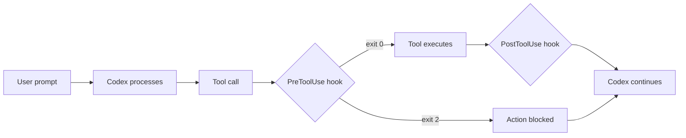

# Appendix B: Hooks

> **Type:** Reference | **Prerequisites:** None

Hooks are user-defined shell commands that execute automatically at specific points in OpenAI Codex's lifecycle. They give you deterministic control over behavior that would otherwise depend on prompting -- auto-formatting code after every edit, blocking changes to protected files, running compliance checks, or sending desktop notifications when Codex needs input.

This appendix covers hook events, configuration syntax, and practical recipes for insurance workflows.

---

## What Hooks Are

Every time OpenAI Codex performs an action -- reading a file, writing code, running a command -- it passes through a lifecycle of events. Hooks let you attach shell commands to those events so certain actions **always happen**, regardless of what Codex was asked to do.

Hooks are not prompts. They are deterministic: a shell script either succeeds (exit 0) or blocks the action (exit 2). This makes them ideal for guardrails that must never be skipped.



---

## Hook Events

Hooks fire at specific moments in the agentic loop. The most commonly used events:

| Event | When it fires | Can block? | Matcher field |
|-------|---------------|------------|---------------|
| `PreToolUse` | Before a tool call executes | Yes | Tool name (`Bash`, `Edit\|Write`, `mcp__.*`) |
| `PostToolUse` | After a tool call succeeds | No | Tool name |
| `Notification` | When Codex sends a notification | No | Notification type (`permission_prompt`, `idle_prompt`) |
| `Stop` | When Codex finishes responding | Yes (can force continue) | None |
| `UserPromptSubmit` | When you submit a prompt, before Codex processes it | Yes | None |
| `SessionStart` | When a session begins or resumes | No | Session source (`startup`, `resume`, `compact`) |
| `SubagentStop` | When a subagent finishes | No | Agent type |
| `PreCompact` | Before context compaction | No | Trigger (`manual`, `auto`) |
| `ConfigChange` | When a config file changes during a session | No | Config source (`project_settings`, `skills`) |

`PreToolUse` and `Stop` are the most useful for guardrails. `PostToolUse` and `Notification` are the most useful for automation and alerting.

---

## Configuration

Hooks are defined in JSON settings files. You can configure them at two levels:

| File | Scope | Shared with team? |
|------|-------|--------------------|
| `.codex/settings.json` | Current project | Yes (commit to version control) |
| `~/.codex/settings.json` | All your projects | No (local to your machine) |

### JSON Structure

```json
{
  "hooks": {
    "EventName": [
      {
        "matcher": "regex_pattern",
        "hooks": [
          {
            "type": "command",
            "command": "shell command to run",
            "timeout": 600
          }
        ]
      }
    ]
  }
}
```

**Three nesting levels:** event → matcher groups → hook commands.

- **`matcher`**: A regex pattern that filters when the hook fires. For tool events, it matches the tool name. Use `""` or omit to match everything.
- **`type`**: Usually `"command"` (shell). Also supports `"prompt"` (single-turn LLM check) and `"agent"` (multi-turn LLM with tool access).
- **`timeout`**: Seconds before the hook is killed. Default: 600 (10 minutes).
- **`async`**: Set to `true` to run in the background without blocking Codex.

### Environment Variables Available to Hooks

| Variable | Description |
|----------|-------------|
| `PWD` | Current working directory |
| Standard shell env | `PATH`, `HOME`, `USER`, etc. |

Hook scripts receive JSON on **stdin** with context about the event:

```json
{
  "session_id": "abc-123",
  "tool_name": "Edit",
  "tool_input": {
    "file_path": "/src/models/pricing.py",
    "old_string": "...",
    "new_string": "..."
  }
}
```

### Exit Code Behavior

| Exit code | Effect |
|-----------|--------|
| **0** | Action proceeds normally |
| **2** | Action blocked. `stderr` text is fed back to Codex as an error message. |
| **Other** | Non-blocking error. `stderr` shown in verbose mode only. |

---

## Practical Recipes

### Auto-format with Prettier After File Edits

Every time Codex writes or edits a file, Prettier reformats it automatically:

```json
{
  "hooks": {
    "PostToolUse": [
      {
        "matcher": "Edit|Write",
        "hooks": [
          {
            "type": "command",
            "command": "jq -r '.tool_input.file_path' | xargs npx prettier --write 2>/dev/null || true"
          }
        ]
      }
    ]
  }
}
```

### Block Edits to Protected Files

Prevent Codex from modifying production actuarial models, environment files, or lock files.

Create `.codex/hooks/protect-files.sh`:

```bash
#!/bin/bash
INPUT=$(cat)
FILE_PATH=$(echo "$INPUT" | jq -r '.tool_input.file_path // empty')

PROTECTED_PATTERNS=(
  "models/production/"
  "actuarial/approved/"
  ".env"
  "package-lock.json"
)

for pattern in "${PROTECTED_PATTERNS[@]}"; do
  if [[ "$FILE_PATH" == *"$pattern"* ]]; then
    echo "Blocked: $FILE_PATH matches protected pattern '$pattern'" >&2
    exit 2
  fi
done

exit 0
```

Then reference it in `.codex/settings.json`:

```json
{
  "hooks": {
    "PreToolUse": [
      {
        "matcher": "Edit|Write",
        "hooks": [
          {
            "type": "command",
            "command": "bash \"$(git rev-parse --show-toplevel)/.codex/hooks/protect-files.sh\""
          }
        ]
      }
    ]
  }
}
```

> **MIG example:** The actuarial team maintains approved pricing models in `models/production/`. This hook ensures Codex cannot modify those files, even if asked to. Changes must go through the standard review process.

### Desktop Notifications When Codex Needs Input

On macOS, trigger a system notification whenever Codex is waiting for you:

```json
{
  "hooks": {
    "Notification": [
      {
        "matcher": "",
        "hooks": [
          {
            "type": "command",
            "command": "osascript -e 'display notification \"OpenAI Codex needs your attention\" with title \"OpenAI Codex\"'"
          }
        ]
      }
    ]
  }
}
```

### Run Compliance Checks After Code Generation

Log every Bash command Codex runs for audit purposes:

```json
{
  "hooks": {
    "PostToolUse": [
      {
        "matcher": "Bash",
        "hooks": [
          {
            "type": "command",
            "command": "jq -c '{timestamp: now | todate, command: .tool_input.command}' >> ~/.codex/command-log.jsonl"
          }
        ]
      }
    ]
  }
}
```

### Block Destructive Database Commands

Prevent Codex from running `DROP`, `DELETE`, or `TRUNCATE` statements:

```json
{
  "hooks": {
    "PreToolUse": [
      {
        "matcher": "Bash",
        "hooks": [
          {
            "type": "command",
            "command": "bash -c 'CMD=$(cat | jq -r .tool_input.command); if echo \"$CMD\" | grep -qiE \"(DROP|DELETE|TRUNCATE)\"; then echo \"Destructive SQL blocked\" >&2; exit 2; fi'"
          }
        ]
      }
    ]
  }
}
```

### Re-inject Context After Compaction

When long sessions compact context, critical instructions can be lost. This hook re-injects them:

```json
{
  "hooks": {
    "SessionStart": [
      {
        "matcher": "compact",
        "hooks": [
          {
            "type": "command",
            "command": "echo 'Reminder: currency format is EUR with European number style (1.000.000,00). Always include Key Takeaways in analytical output.'"
          }
        ]
      }
    ]
  }
}
```

---

## Debugging Hooks

- **Toggle verbose mode** with `Ctrl+O` to see hook output in the terminal
- **Run with debug logging**: `codex --debug` shows full hook execution details
- **Check `/hooks`** in a session to see all registered hooks
- **Test scripts manually**: `echo '{"tool_name":"Edit","tool_input":{"file_path":"test.py"}}' | bash .codex/hooks/protect-files.sh`
- **Verify `jq` is installed**: hooks that parse JSON input require it (`brew install jq` on macOS)

Common issues:
- Hook not firing → check matcher is case-sensitive and matches tool name exactly
- JSON parse error → shell profile `echo` statements can interfere; make them conditional on interactive shells
- Hook blocks unexpectedly → test your regex pattern against actual tool input JSON

---

## Key Takeaways

- Hooks provide **deterministic** control -- shell scripts that always run, unlike prompts that can be ignored
- `PreToolUse` hooks can **block** actions before they happen (exit code 2); `PostToolUse` hooks can automate follow-up actions
- Configure hooks in `.codex/settings.json` (project, shared) or `~/.codex/settings.json` (personal, all projects)
- For insurance workflows, hooks are valuable for protecting production models, enforcing formatting standards, logging commands for audit, and blocking destructive database operations
- Hooks receive JSON on stdin with event context; use `jq` to extract fields like `tool_input.file_path`
- Start with one or two simple hooks (auto-format + file protection) and add more as you identify patterns worth automating
