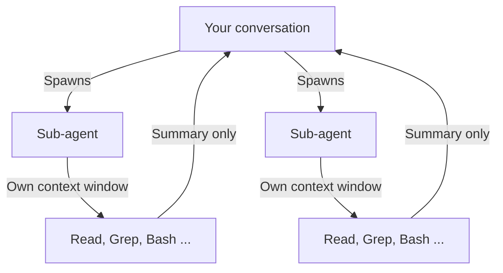
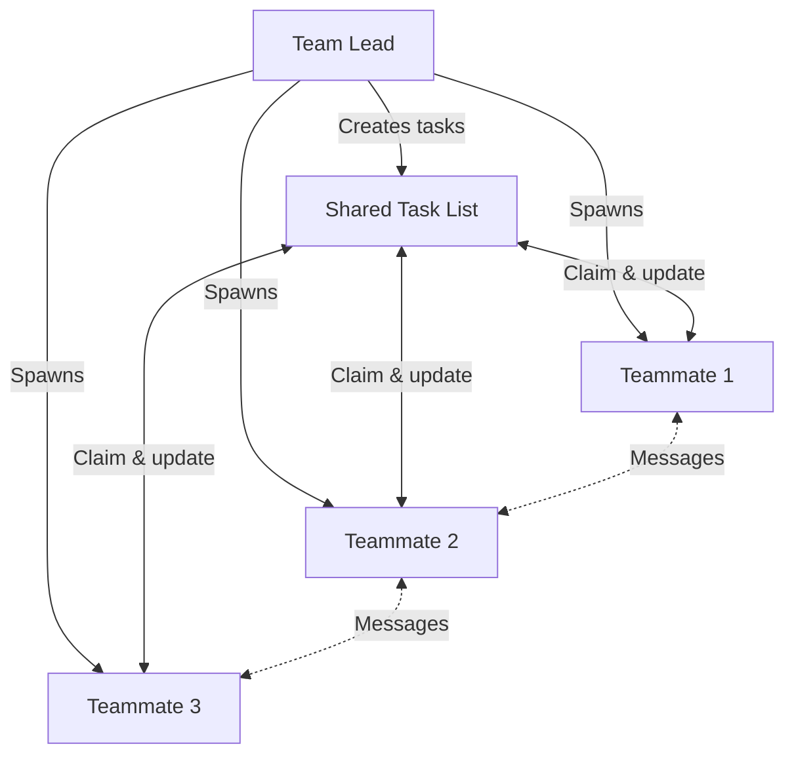

# Appendix D: Sub-agents & Agent Teams

> **Type:** Reference | **Prerequisites:** None

OpenAI Codex can delegate work to **sub-agents** -- specialized instances that run in their own context window, work independently, and return results. This keeps your main conversation clean while handling complex, multi-step tasks in parallel. Beyond built-in sub-agents, you can define **custom agents** for your team and coordinate **agent teams** where multiple instances collaborate on the same problem.

This appendix covers the Task tool, custom agent definitions, and multi-agent coordination patterns.

---

## What Sub-agents Are

When OpenAI Codex encounters a task that benefits from isolation -- exploring a large codebase, running a long test suite, researching a topic -- it can spawn a sub-agent using the **Task tool**. Each sub-agent:

- Gets its own context window (the parent's conversation history does not carry over)
- Has a custom system prompt tailored to its role
- Can access a defined set of tools
- Returns a summary to the parent when finished

This isolation is the key benefit: verbose output (hundreds of grep results, full test logs) stays in the sub-agent's context while only the relevant findings return to your conversation.



---

## Built-in Agent Types

OpenAI Codex includes several built-in sub-agents:

| Agent | Model | Tools | Purpose |
|-------|-------|-------|---------|
| **Explore** | Haiku (fast) | Read-only (Read, Grep, Glob) | Codebase search and exploration |
| **Plan** | Inherits | Read-only | Research during plan mode |
| **General-purpose** | Inherits | All tools | Complex multi-step tasks |

Codex delegates to these automatically based on the task. You can also request them explicitly:

```
Use an Explore agent to find all files related to motor pricing.
Use a sub-agent to run the full test suite and report only failures.
```

---

## Custom Agents

Custom agents let you define reusable, team-specific roles with controlled tool access.

### File Format

Agent definitions use YAML frontmatter for configuration and Markdown for the system prompt:

```markdown
---
name: claims-analyst
description: Analyzes claims data and produces loss ratio reports. Use for any claims-related analysis.
tools: Read, Glob, Grep, Bash
model: sonnet
---

You are a claims data analyst for Mediterranean Insurance Group.

When analyzing claims data:
- Always report figures in EUR with European number format (1.000.000,00)
- Calculate loss ratios as: incurred claims / earned premium
- Break down results by business line (Motor, Home, Health, Commercial Property, Life)
- Include a Key Takeaways section in every report
- Flag any data quality issues you notice
```

### Where to Store Agents

| Location | Scope | Shared? | Priority |
|----------|-------|---------|----------|
| `.codex/agents/` | Current project | Yes (commit to repo) | Highest |
| `~/.codex/agents/` | All your projects | No (local) | Lower |

Project agents (`.codex/agents/`) are ideal for team-shared roles. Commit them to version control so your team uses and improves them together.

### Configuration Options

| Field | Required | Description |
|-------|----------|-------------|
| `name` | Yes | Unique identifier (lowercase, hyphens) |
| `description` | Yes | When Codex should delegate to this agent (natural language) |
| `tools` | No | Tools the agent can use. Inherits all if omitted. |
| `disallowedTools` | No | Tools to explicitly deny |
| `model` | No | `sonnet`, `opus`, `haiku`, or `inherit` (default) |
| `permissionMode` | No | `default`, `acceptEdits`, `dontAsk`, `plan` |
| `maxTurns` | No | Maximum agentic turns before stopping |
| `memory` | No | Persistent memory scope: `user`, `project`, or `local` |
| `isolation` | No | Set to `worktree` for git worktree isolation |
| `skills` | No | Skills to preload into the agent's context |
| `mcpServers` | No | MCP servers available to this agent |
| `hooks` | No | Lifecycle hooks scoped to this agent |

### Invoking Custom Agents

Codex delegates automatically based on the `description` field. You can also be explicit:

```
Use the claims-analyst agent to analyze Q3 motor claims.
Have the compliance-checker review the new pricing module.
```

Manage agents interactively with `/agents` inside a session, or list them from the CLI:

```bash
codex agents
```

### Practical Agent Definitions

**Compliance checker for regulatory reviews:**

```markdown
---
name: compliance-checker
description: Reviews code and documents for regulatory compliance. Use for any compliance-related review.
tools: Read, Glob, Grep
model: sonnet
permissionMode: plan
---

You are a regulatory compliance reviewer for a Southern European insurer.

Check for compliance with:
- Solvency II requirements (SCR calculations, ORSA documentation)
- Local regulators: DGSFP (Spain), IVASS (Italy), ASF (Portugal), ACPR (France)
- Data protection (GDPR) requirements in data handling code

Flag potential issues with specific regulatory references. Do not invent article numbers.
```

**Portfolio analyst per business line:**

```markdown
---
name: portfolio-analyst
description: Analyzes insurance portfolio data by business line. Use for portfolio reviews and performance analysis.
tools: Read, Glob, Grep, Bash
model: sonnet
---

You are a portfolio analyst for Mediterranean Insurance Group.

When analyzing portfolio data:
- Report all currency figures in EUR with European format
- Calculate combined ratio as: (incurred claims + expenses) / earned premium
- Compare against MIG benchmarks: combined ratio target 96.2%, Solvency II ratio 178%
- Break down by market: Spain (52%), Italy (22%), Portugal (14%), Southern France (12%)
- Always include Key Takeaways
```

---

## Agent Teams (Experimental)

Agent teams go beyond sub-agents. Instead of isolated workers reporting back to a parent, teams are **separate OpenAI Codex instances** that communicate with each other through a shared task list and messaging system.

> **Status:** Experimental. Enable with `CLAUDE_CODE_EXPERIMENTAL_AGENT_TEAMS=1`.

### How Teams Work



| Component | Role |
|-----------|------|
| **Team lead** | Your main OpenAI Codex session. Creates the team, spawns teammates, coordinates. |
| **Teammates** | Separate OpenAI Codex instances. Each claims tasks, works independently, messages others. |
| **Task list** | Shared work items with dependency tracking. Teammates self-assign and update status. |
| **Mailbox** | Direct messaging between agents for coordination. |

### Starting a Team

Describe the work and let the lead organize:

```
Analyze the Q3 portfolio across all business lines. Create an agent team:
- One teammate for Motor (45% of book)
- One teammate for Home and Health
- One teammate for Commercial Property and Life
- One teammate to synthesize findings into an executive summary

Each analyst should calculate loss ratios, flag trends, and identify outliers.
The synthesizer should wait for all three analysts to finish before starting.
```

The lead spawns teammates, creates the task list with dependencies (synthesizer blocked by analysts), and coordinates.

### Display Modes

| Mode | Display | Requirements |
|------|---------|-------------|
| `auto` (default) | Split panes if tmux available, otherwise in-process | None |
| `in-process` | All teammates in your terminal | Any terminal |
| `tmux` | Each teammate in a separate pane | tmux or iTerm2 |

Configure in settings:

```json
{
  "teammateMode": "in-process"
}
```

### Practical Team Patterns

**Multi-market regulatory review:**

```
Create an agent team to review the new pricing module for regulatory compliance
across all our markets:
- Teammate 1: Spanish regulations (DGSFP)
- Teammate 2: Italian regulations (IVASS)
- Teammate 3: Portuguese regulations (ASF)
- Teammate 4: French regulations (ACPR)
Each reviewer should flag potential issues with specific regulatory references.
```

**Code review from multiple perspectives:**

```
Review PR #142 with an agent team:
- Security reviewer: focus on authentication, data handling, injection risks
- Performance reviewer: database queries, algorithmic complexity, memory usage
- Test reviewer: coverage gaps, edge cases, assertion quality
Have them discuss findings and agree on priority items.
```

**Competing hypotheses investigation:**

```
Users report intermittent policy lookup failures. Create a team of 3 investigators,
each pursuing a different hypothesis:
1. Database connection pooling under load
2. Cache invalidation after the LusoProtect migration
3. Network timeouts to the Portugal region
Have them share evidence and challenge each other's theories.
```

### Sub-agents vs. Agent Teams

| Aspect | Sub-agents | Agent Teams |
|--------|-----------|-------------|
| Context | Own window; results return to parent | Own window; fully independent |
| Communication | Report to parent only | Message each other directly |
| Coordination | Parent manages all work | Shared task list, self-assignment |
| Best for | Focused, isolated tasks | Complex work needing discussion |
| Token cost | Lower (summarized results) | Higher (separate instances) |
| Status | Production | Experimental |

Use sub-agents for most work. Use agent teams when teammates need to **discuss, challenge, and build on** each other's findings.

---

## Worktree Isolation

Sub-agents and teammates can work in isolated git worktrees to avoid file conflicts:

```bash
codex --worktree feature-auth
```

Or in agent definitions:

```yaml
---
name: feature-builder
isolation: worktree
---
```

Each worktree gets its own branch and working directory at `.codex/worktrees/<name>/`. Worktrees with no changes are cleaned up automatically; those with changes prompt you to keep or remove.

---

## Cost Considerations

Sub-agents and agent teams increase token usage. Each sub-agent maintains its own context window -- a team of 4 uses roughly 4x the tokens of a single session.

**Practical guidelines:**

- Use **Haiku** or **Sonnet** for sub-agents when possible (cheaper, often sufficient)
- Keep spawn prompts focused -- everything in the prompt adds to initial context
- Size tasks as self-contained units: 5-6 tasks per teammate is a productive range
- Clean up teams when done -- active teammates consume tokens even when idle
- Avoid assigning two agents to the same file (causes overwrites); break work by file ownership

| Scenario | Recommended approach |
|----------|---------------------|
| Sequential tasks with tight dependencies | Single session or sub-agents |
| Same-file edits | Single session |
| Parallel research across topics | Sub-agents |
| Parallel work needing discussion | Agent teams |
| High-volume output (test suites, logs) | Sub-agent (keeps output isolated) |

---

## Key Takeaways

- Sub-agents are isolated Codex instances that keep verbose work out of your main conversation and return only relevant findings
- Built-in agents (Explore, Plan, General-purpose) handle common patterns automatically; custom agents in `.codex/agents/` add team-specific roles
- Custom agent definitions use YAML frontmatter + Markdown and can be committed to version control for team sharing
- Agent teams (experimental) enable multiple Codex instances to collaborate through shared task lists and direct messaging
- For insurance workflows, sub-agents are useful for parallel portfolio analysis by business line, multi-market regulatory review, and multi-perspective code review
- Each sub-agent uses its own context window -- consider model choice and task sizing to manage costs
- For a comparison between sub-agents in OpenAI Codex and sub-agents in Codex Cowork, see [Appendix A: Codex Cowork](/appendix/codex-cowork)
