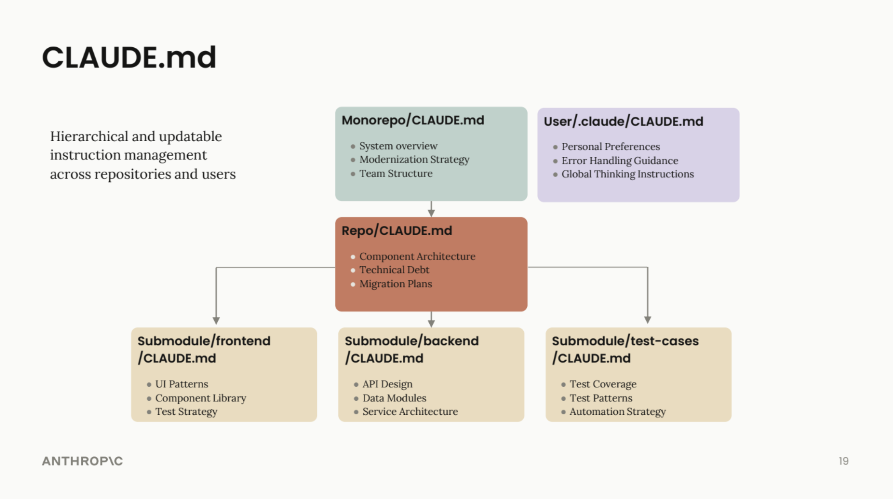

# Module 1.2: Project Memory with AGENTS.md

> **Time:** 15 minutes | **Prerequisites:** [Module 1.1: First Steps](../1.1-first-steps/README.md)

## The Problem

Every time you start a new OpenAI Codex session, OpenAI Codex starts with a blank slate. It does not remember that you work at MIG, that you prefer tables over paragraphs, or that all figures should be in EUR. You end up repeating the same context every time.

**AGENTS.md solves this.** It is a file that OpenAI Codex reads automatically at the start of every session, giving it persistent memory about your project, preferences, and rules.

---

## What Is AGENTS.md?

AGENTS.md is a plain text file you place in your project folder. When you start OpenAI Codex in that folder, OpenAI Codex reads the file before you say anything. Think of it as a briefing document you hand to a new team member on their first day.

You can have:

- **Project-level AGENTS.md** -- lives in your project folder, applies to that project only
- **Global AGENTS.md** -- lives in your home directory (`~/.codex/AGENTS.md`), applies to every session everywhere



_AGENTS.md supports a hierarchical structure -- from monorepo-level overviews to submodule-specific instructions, plus personal user preferences._

Most people use project-level files. Use a global file for preferences that apply to all your work (language, formatting style, etc.).

---

## Creating a AGENTS.md for an Insurance Project

You can create this file in two ways.

### Option A: Ask Codex to create it

```text
Create a AGENTS.md file in the current directory with the following project context:

This is a project for Mediterranean Insurance Group (MIG), a mid-size
European insurer headquartered in Barcelona. We operate across Spain,
France, and Italy, with a recent acquisition in Portugal (LusoProtect).

Include rules for consistent terminology, formatting, and output quality.
```

### Option B: The quick way with #

While in an OpenAI Codex session, type `#` followed by a rule, and OpenAI Codex will add it to your AGENTS.md automatically:

```text
# Always use EUR as the default currency, never USD
```

```text
# When presenting financial figures, use European format: 1.000.000,00
```

```text
# All documents should follow Solvency II terminology where applicable
```

This is the fastest way to build up your AGENTS.md over time as you discover new rules you want enforced.

---

## Example AGENTS.md for MIG

Here is a complete example you can adapt for your projects:

```markdown
# Project Context

This project supports Mediterranean Insurance Group (MIG), a mid-size
composite insurer headquartered in Barcelona, Spain.

## About MIG
- Founded in 1987, ~2,400 employees
- Operates in Spain, France, and Italy
- Recently acquired LusoProtect (Portugal) in 2025
- Lines of business: motor, property, liability, marine, health
- Gross written premium: approximately EUR 1.8 billion (2025)
- Regulated under Solvency II (EIOPA framework)

## Terminology Rules
- Use "gross written premium" (GWP), not "gross premiums written"
- Use "incurred claims" not "losses" when referring to claims costs
- Use "combined ratio" not "combined operating ratio"
- Use "cedant" not "ceding company" when referring to reinsurance
- Use "Solvency Capital Requirement (SCR)" on first mention, then "SCR"
- Use "Own Risk and Solvency Assessment (ORSA)" on first mention, then "ORSA"
- Product lines: Motor, Property, General Liability, Marine Cargo, Health

## Formatting Preferences
- Currency: always EUR, never USD unless explicitly comparing markets
- Number format: European style (1.000.000,00) in client documents
- Dates: DD/MM/YYYY (European standard)
- Tables are preferred over long paragraphs for data presentation
- Executive summaries should be under 250 words
- Always include a "Key Takeaways" section in analytical documents

## Quality Rules
- Always cite data sources when presenting market statistics
- Flag any figures that are estimates vs. confirmed actuals
- When calculating ratios, show the formula and inputs
- Include caveats and limitations in any analytical work
- Do not invent specific regulatory article numbers -- reference them
  generally or ask me to confirm
- All client-facing documents need a professional, measured tone
- Avoid jargon when writing for C-suite audiences unless they are
  insurance specialists

## Regional Context
- Spain: DGSFP is the local supervisor
- France: ACPR is the local supervisor
- Italy: IVASS is the local supervisor
- Portugal: ASF is the local supervisor (relevant for LusoProtect integration)
```

---

## How It Works in Practice

**Without AGENTS.md:**

```text
You: Calculate the loss ratio for our motor portfolio.

Codex: The loss ratio is $2,500,000 / $5,000,000 = 50%...
```

Wrong currency, wrong format, no context about MIG.

**With AGENTS.md:**

```text
You: Calculate the loss ratio for our motor portfolio.

Codex: Based on MIG's motor portfolio:

Loss Ratio = Incurred Claims / Earned Premium
Loss Ratio = EUR 2.500.000 / EUR 5.000.000 = 50,0%

This is below MIG's target combined ratio threshold...
```

OpenAI Codex automatically applies the right currency, number format, terminology, and context.

---

## Tips for Maintaining Your AGENTS.md

1. **Start small.** You do not need to write the perfect AGENTS.md on day one. Start with the basics (who you are, what project this is, key formatting rules) and add rules as you discover needs.

2. **Use # to add rules on the fly.** When Codex does something you do not like, add a rule immediately:
   ```text
   # Never abbreviate country names -- always write "Spain" not "ES"
   ```

3. **Keep it under 1-2 pages.** A AGENTS.md that is too long becomes noise. Focus on rules that you would otherwise repeat in every session.

4. **Review it periodically.** As projects evolve, some rules become irrelevant. Clean it up every few weeks.

5. **Share it with your team.** If multiple people work on the same project, a shared AGENTS.md ensures everyone gets consistent output from OpenAI Codex.

> **Pro Tip:** Commit your AGENTS.md to version control (Git). This ensures every team member working on the project gets the exact same formatting rules, terminology standards, and workflow context from OpenAI Codex. When someone clones the repo or pulls the latest changes, they automatically get the up-to-date project instructions.

---

## Exercise: Create Your Own AGENTS.md

Take 5 minutes to create a AGENTS.md for a project you are currently working on. Include at minimum:

1. One paragraph of project context (who is the client, what is the engagement about)
2. Three terminology rules specific to your work
3. Two formatting preferences
4. Two quality rules

You can do this by asking Codex:

```text
Create a AGENTS.md for my current project. Here's the context:
[describe your project in 2-3 sentences]

I want rules for terminology, formatting, and quality. Ask me questions
if you need more detail.
```

---

## Next Step

Proceed to [Module 2.1: Writing an Underwriting Brief](../../2-insurance-workflows/2.1-underwriting-brief/README.md) to apply what you have learned to a real insurance workflow.
