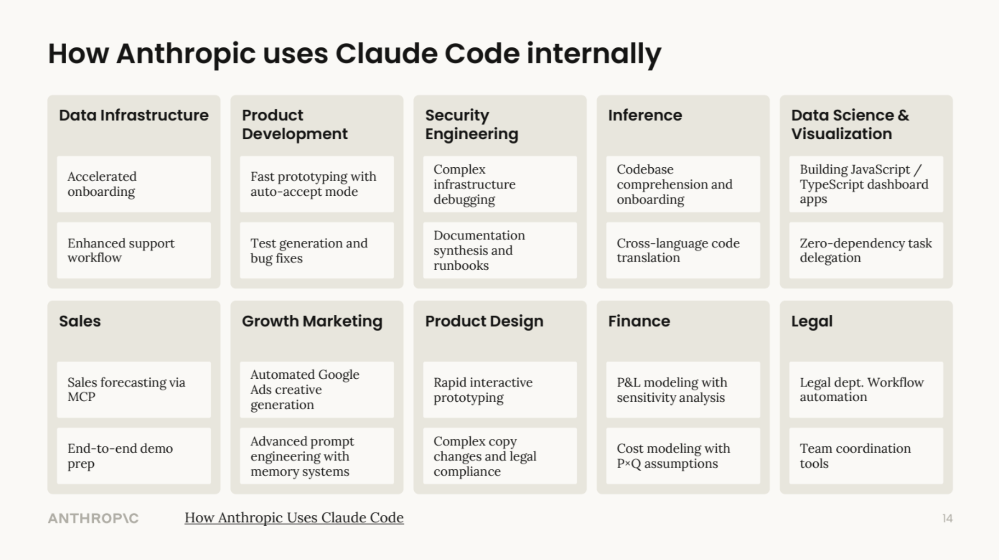

# What Is OpenAI Codex?

> **Time:** 5 minutes | **Prerequisites:** None

OpenAI Codex is a command-line tool that lets you work with Codex directly in your terminal using natural language. You type instructions in plain English (or Spanish, or any language), and Codex reads your files, writes documents, searches the web, and runs tasks for you.

**You do not need to know how to code.** You give instructions. Codex does the work.

---

### What Can OpenAI Codex Do?

- **Read files** on your computer (reports, spreadsheets, documents)
- **Write and create files** (briefs, summaries, emails, analyses)
- **Search the web** for up-to-date market data, regulations, and news
- **Organize and analyze data** from CSVs, Excel exports, and other files
- **Run commands** on your system (create folders, manage files)

### What It Cannot Do

- Access your email or calendar directly
- Log into websites on your behalf
- Replace your professional judgment on underwriting or compliance decisions

---

## Beyond Individual Tasks: Transforming How Teams Work

OpenAI Codex is not limited to one-off tasks. Organizations are using it to augment entire workflows -- from discovery and planning through delivery and support.

_OpenAI Codex supports every phase of the software development lifecycle -- from discovery and design through build, deploy, and ongoing support._

_OpenAI uses OpenAI Codex across all departments -- from data infrastructure and product development to sales, legal, and finance._

---

## Next Step

Proceed to [Install OpenAI Codex](/getting-started/install) to set up your environment.
